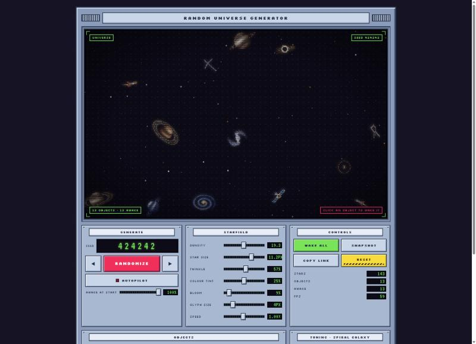

# Random Universe Generator

A tiny browser toy that makes a random universe out of ASCII characters: spiral galaxies, comets, ringed planets, pulsars, black holes, rockets, satellites and real constellations. Everything starts asleep and grey. **Click anything to wake it up** and it blooms into colour and motion.

The interface is a retro spaceship control panel: a rectangular viewport on top, a deck of controls underneath.



## Run it

```bash
npm install
npm run dev        # http://localhost:5173
```

```bash
npm run build      # type-checks, then builds to dist/
npm run preview    # serves the built site
```

No framework: TypeScript, Vite, a canvas and some CSS.

## What you can do

| Control | What it does |
| --- | --- |
| **Randomize** (or <kbd>R</kbd>) | Generates a new universe from a random six-digit seed. |
| **◀ / ▶** | Steps to the previous or next seed. |
| **Seed display** | Click it and type a seed to jump straight to that universe. |
| **Autopilot** (or <kbd>A</kbd>) | Wakes the sky one object at a time, rests, then flies to a new universe. |
| **Awake at start** | How many objects are already awake in a freshly generated universe. |
| **Starfield** | Star density, size, twinkle, colour tint, bloom, glyph size and overall speed. |
| **Objects** | How many of each of the seven kinds. Click a name to tune that kind's size and speed. |
| **Wake all** (or <kbd>W</kbd>) / **Reset** | Wake everything, or put everything back to sleep. |
| **Snapshot** | Saves the current view as a PNG. |
| **Copy link** | Copies a link to this exact universe. |

### Same seed, same universe

The address bar always describes what you're looking at: `#seed=424242`. Open that link anywhere and you get the same sky: the same objects, varied the same way. Where they sit depends on the size of the viewport, so the layout matches at the same window size. If you change any setting by hand, the link also carries those settings, so what you share is what you see.

## The objects

Each kind has an asleep look (grey, still) and an awake look (colour and motion), and each one in a universe is a different variation of its kind.

- **Spiral galaxy**: four spiral types (grand-design, barred, ring, single-arm), each seen from its own angle, with its own palette and slow spin.
- **Comet**: a round head and a fan of dashes streaming away like a blast.
- **Spacecraft**: rockets that trail flame and smoke, and satellites with solar wings, drifting on slow curves, lines and orbits.
- **Ringed planet**: banded gas giants with storms and one to three rings, seen from different angles.
- **Pulsar**: a six-ray star that beats and sends a ring across the sky, lighting the stars it passes.
- **Black hole**: a spinning accretion disk. Wake one and the nearby stars are yanked in.
- **Constellation**: Orion, Scorpius, the Big Dipper, Cassiopeia, Leo and Cygnus, drawn from real star positions.

## How it works

- The sky is a grid of character cells. Each frame, every object paints glyphs into that grid (brightness picks the character, and a palette colour is attached), then the grid is drawn to a `<canvas>`. A soft bloom is added on top for the glowing objects.
- A seed drives everything: the settings (`src/random.ts`), where each object sits, and how each one varies. The engine lives in `src/universe/` (`scene.ts` places things and runs the frame, `objects.ts` draws the seven kinds).
- The colours are CSS custom properties (`--color-cosmos-*` in `src/style.css`); the engine reads them at start-up, so re-theming the universe is a CSS edit.
- It respects `prefers-reduced-motion`: objects still change colour when woken, but nothing moves.

## Credits

The universe engine was first built for the hero of a portfolio site's home page and pulled out into its own project here. The control panel takes its look from retro pixel-art spaceship interfaces. Fonts: [Silkscreen](https://fonts.google.com/specimen/Silkscreen), [VT323](https://fonts.google.com/specimen/VT323) and [Space Mono](https://fonts.google.com/specimen/Space+Mono), served through [Fontsource](https://fontsource.org).

## License

MIT, see [LICENSE](LICENSE).
